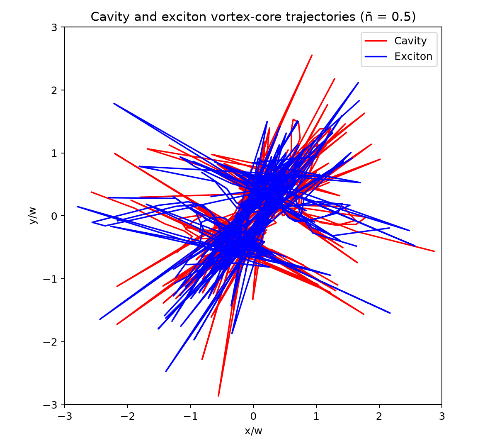

# Coherence in Polaritonic Vortices

Numerical study of coherence, cavity–exciton dynamics, angular momentum, reduced states, vortex-core trajectories, and spatial reconstruction in a coupled polaritonic system.

This repository is a cleaned and reproducible version of the research notebooks developed for the project. The numerical implementation separates the physical model, basis construction, initial state, dynamics, reduced density matrices, observables, vortex trajectories, and spatial fields into tested Python modules.

## Reference case

The figures below are generated directly from the repository code for the validated reference case

\[
\bar n = |\alpha|^2 = 0.5,
\]

with cavity and exciton triangular cutoffs equal to 8. The initial finite-basis norm is approximately `0.999949558243`; the small deficit from unity is retained rather than silently renormalized so that truncation effects remain visible.

### Angular momentum dynamics

The cavity and exciton angular momenta exchange during the evolution while their sum remains numerically conserved within the integration tolerance.


### Linear entropy

The quantity shown is the linear entropy

\[
S_L = 1 - \mathrm{Tr}(\rho^2),
\]

computed from a reduced density matrix. For the pure bipartite state, the cavity and exciton reductions have the same purity.


### Vortex-core spatial trajectories

The vortex-core positions are reconstructed with the same method used in the original research notebooks. For each reduced cavity or exciton density matrix, the common Gaussian factor is removed and the spatial density is expanded around the origin as

\[
F(x,y) \simeq a + b x + c y + d x^2 + e y^2 + gxy.
\]

The stationary point of this quadratic approximation is evaluated at each time and interpreted as the vortex-core position. The displayed trajectories reproduce the original plotting logic: `30 fps`, a duration of `20`, coordinates in units of `x/w` and `y/w`, and a plotting radius `R = 3`. Points outside that radius are skipped with line breaks, exactly as in the source notebooks.

**Original-style cavity and exciton panels**


**Combined cavity/exciton comparison**



### Spatial reconstruction at t = 0

**Cavity reduced spatial density**


**Exciton reduced spatial density**


## Repository structure

```text
.
├── src/polaritonic_vortices/
│   ├── parameters.py
│   ├── basis.py
│   ├── initial_state.py
│   ├── dynamics.py
│   ├── reduced_density.py
│   ├── observables.py
│   ├── trajectories.py
│   └── spatial_fields.py
├── examples/
│   ├── run_mean_photon_scan.py
│   └── generate_reference_figures.py
├── tests/
├── results/
│   └── figures/          # generated automatically and displayed here
├── requirements.txt
└── pyproject.toml
```

## Reproducibility

The reference figures are not manually edited outputs. They are generated by

```bash
python examples/generate_reference_figures.py
```

A GitHub Actions workflow runs the automated tests first, then runs the same figure-generation command when the scientific source code or figure-generation script changes, and commits updated figures to `results/figures/`. Therefore the plots displayed in this README can be viewed directly on GitHub without Codespaces.

To reproduce the calculation locally:

```bash
pip install -e .
pytest
python examples/generate_reference_figures.py
```

## Numerical validation

The test suite includes checks for basis dimensions and indexing, coherent-state parameterization, selected values from the original notebooks, sparse coupling matrices, norm conservation, reduced density matrices, linear entropy, angular momentum, the original Hermite/Taylor vortex-core trajectory method and sampling logic, and spatial-field reconstruction.

The original exploratory notebooks are intentionally not published as the primary implementation because several contain duplicated code, stale execution state, or parameter values that do not match their filenames. The cleaned implementation preserves the validated physics and the original trajectory construction while making the numerical assumptions explicit.
