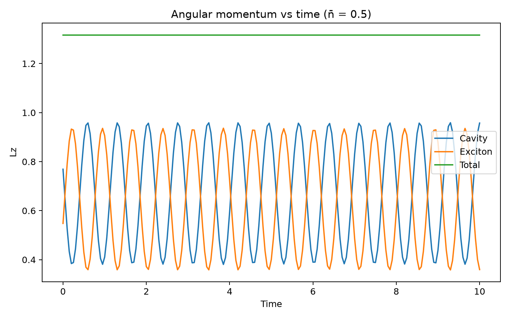
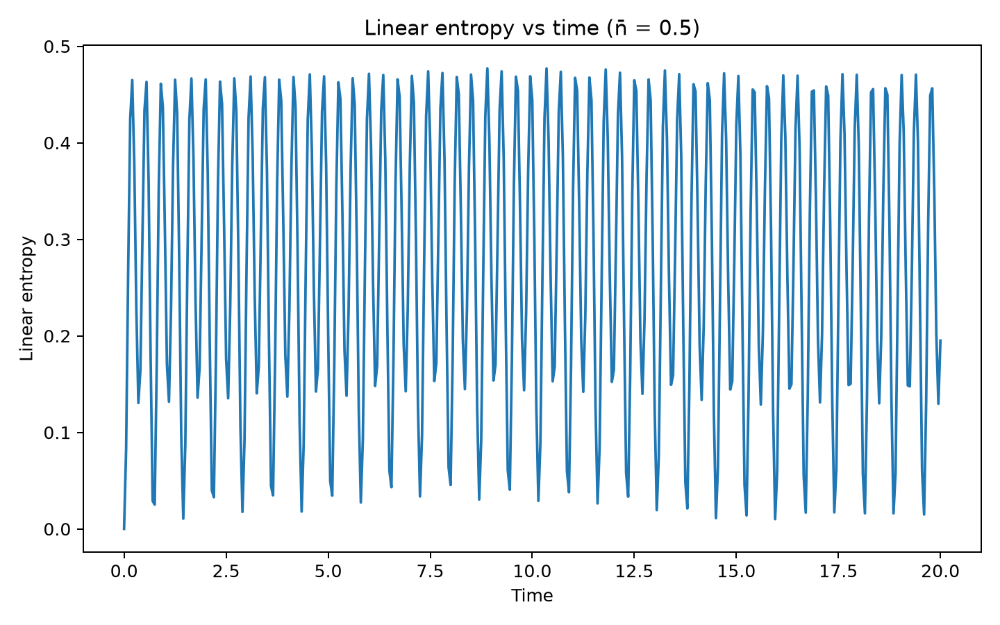
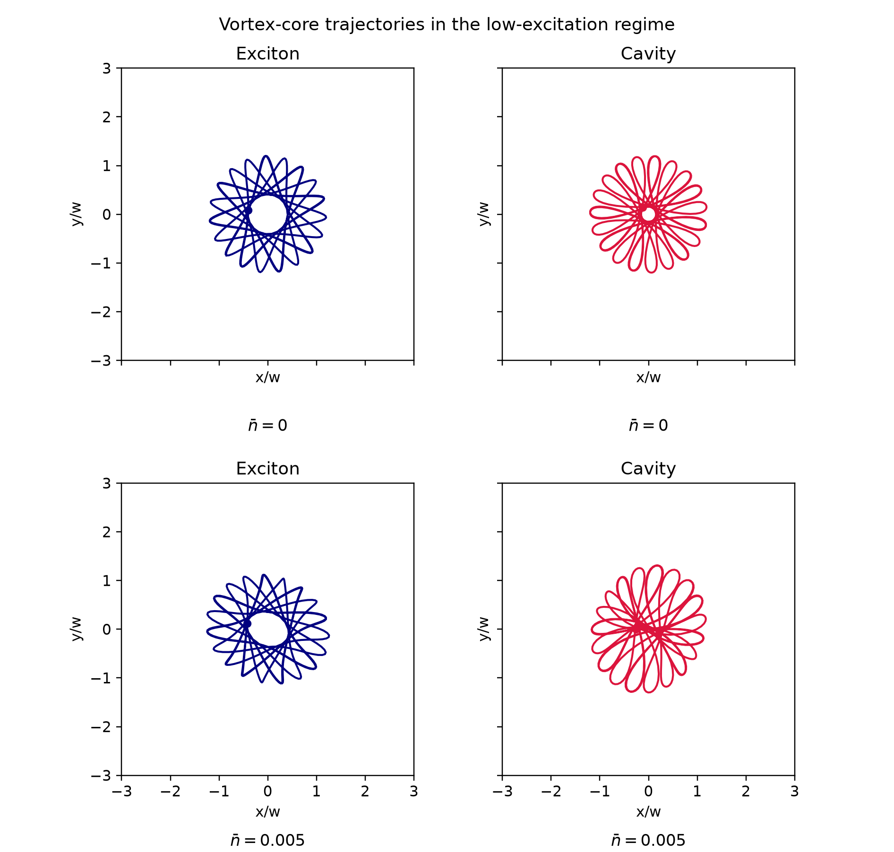
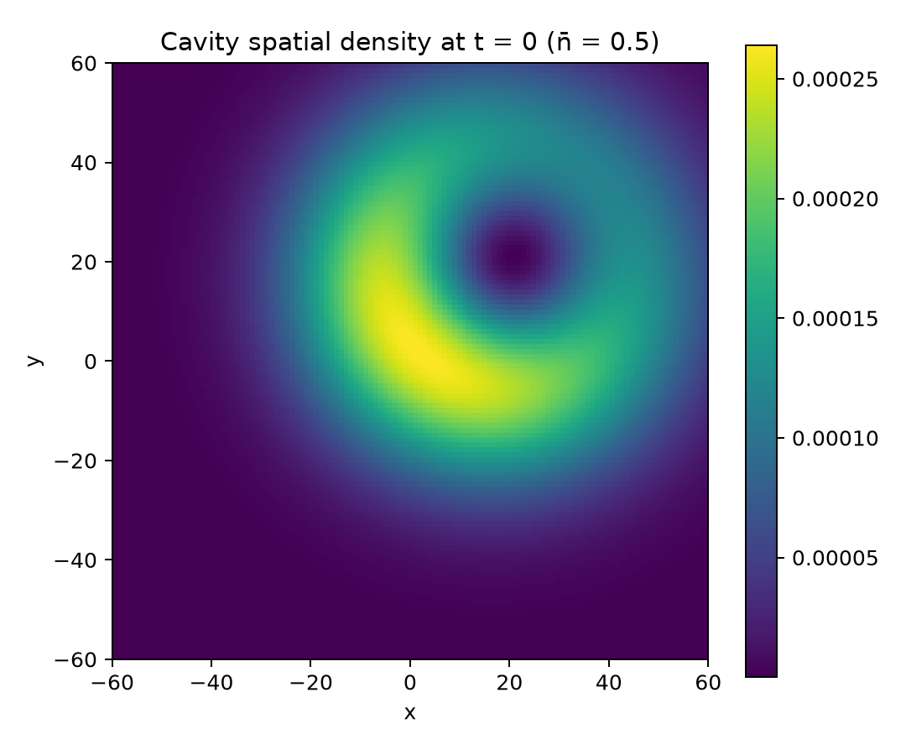
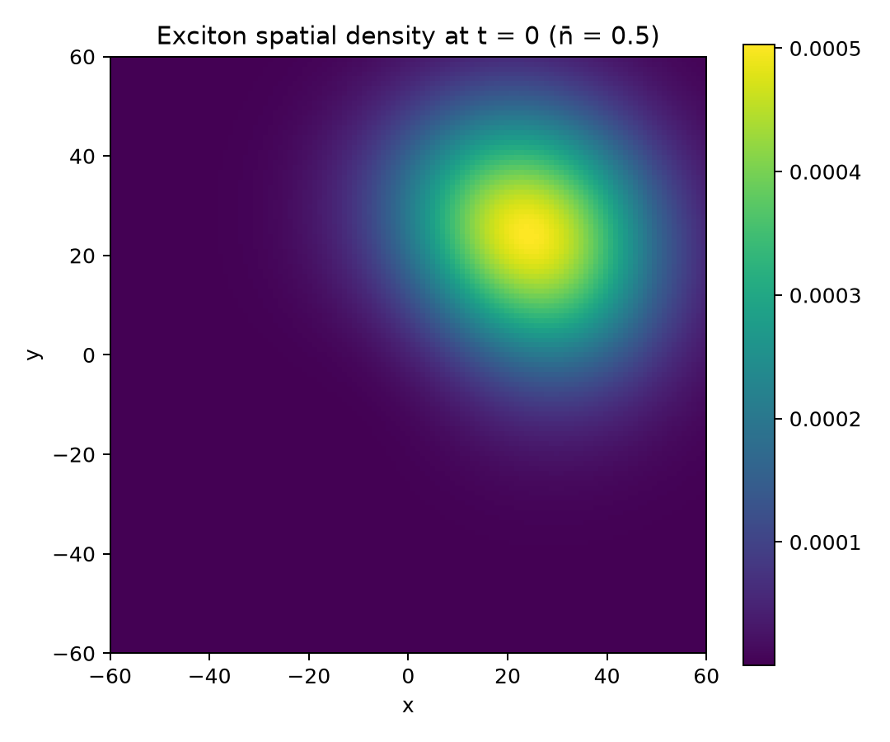

# Coherence in Polaritonic Vortices

Numerical study of coherence, cavity–exciton dynamics, angular momentum, reduced states, vortex-core trajectories, and spatial reconstruction in a coupled polaritonic system.

The project is organized as a reproducible Python implementation of the physical model. Basis construction, initial-state preparation, time evolution, reduced density matrices, observables, vortex-core trajectories, and spatial fields are implemented as separate tested modules.

## Reference calculations

The angular-momentum, entropy, and spatial-density results use the reference configuration

$$
\bar n = |\alpha|^2 = 0.5,
$$

with cavity and exciton triangular cutoffs equal to 8. For this finite basis, the initial-state norm is approximately `0.999949558243`.

### Angular momentum dynamics

The cavity and exciton angular momenta exchange during the evolution, while the total angular momentum remains numerically conserved within the integration tolerance.



### Linear entropy

The reduced-state linear entropy is defined as

$$
S_L = 1 - \mathrm{Tr}(\rho^2).
$$

For the pure bipartite state, the cavity and exciton reduced density matrices have the same purity.



### Vortex-core trajectories: low-excitation regime

The trajectory comparison focuses on two coherent-state mean excitations:

$$
\bar n = 0
\qquad\text{and}\qquad
\bar n = 0.005.
$$

Both cases use the same physical parameters. The comparison highlights the evolution of the cavity and exciton vortex cores in the low-excitation regime.

The vortex-core position is obtained from the reduced spatial density. After removing the common Gaussian factor, the density is expanded around the origin as

$$
F(x,y) \simeq a + bx + cy + dx^2 + ey^2 + gxy.
$$

The stationary point of this quadratic expansion defines the core coordinates at each time. Trajectories are sampled at 30 fps over a duration of 20, expressed in units of $x/w$ and $y/w$, and displayed inside the radius $R=3$.



Individual trajectory panels are available as `results/figures/vortex_core_trajectories_nbar0.png` and `results/figures/vortex_core_trajectories_nbar0005.png`.

### Spatial reconstruction at $t=0$

**Cavity reduced spatial density**



**Exciton reduced spatial density**



## Repository structure

```text
.
├── src/polaritonic_vortices/
│   ├── parameters.py
│   ├── basis.py
│   ├── initial_state.py
│   ├── dynamics.py
│   ├── reduced_density.py
│   ├── observables.py
│   ├── trajectories.py
│   └── spatial_fields.py
├── examples/
│   ├── run_mean_photon_scan.py
│   └── generate_reference_figures.py
├── tests/
├── results/
│   └── figures/
├── requirements.txt
└── pyproject.toml
```

## Reproducibility

The figures displayed in this README are generated with

```bash
python examples/generate_reference_figures.py
```

A GitHub Actions workflow runs the test suite and regenerates the figures when the scientific source code or figure-generation script changes. The resulting PNG files are stored in `results/figures/` and render directly on GitHub.

To reproduce the calculations locally:

```bash
pip install -e .
pytest
python examples/generate_reference_figures.py
```

## Numerical validation

The test suite covers basis dimensions and indexing, coherent-state parameterization, sparse coupling matrices, norm conservation, reduced density matrices, linear entropy, angular momentum, Hermite/Taylor vortex-core trajectories, trajectory sampling, and spatial-field reconstruction.
